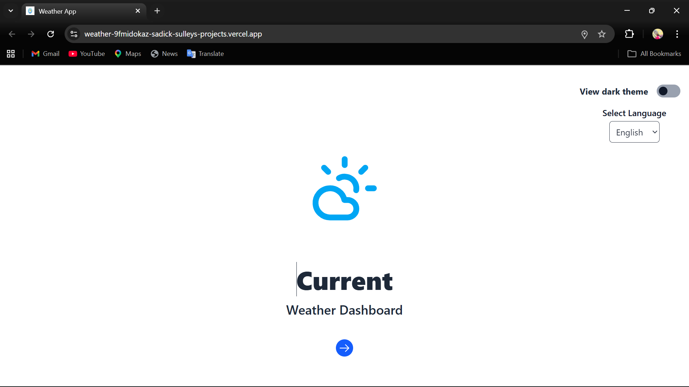
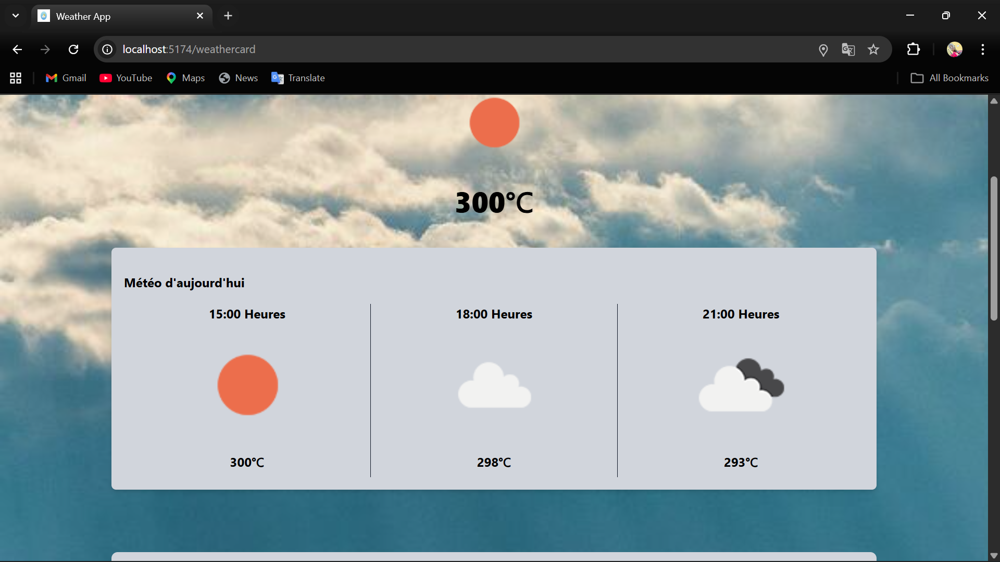

<div align="center">

# 🌤️ WeatherApp

### A smart, real-time weather dashboard — beautifully designed, globally aware.

[](https://weather-9fmidokaz-sadick-sulleys-projects.vercel.app/)
[](https://vitejs.dev/)
[](https://tailwindcss.com/)
[](LICENSE)

<br/>

> **ALX Frontend Engineering Program — Capstone Project**  
> Built by [Sadick Sulley](https://github.com/sulley-sadick)

<br/>


</div>

---

## 📖 Overview

**WeatherApp** is a modern, responsive weather dashboard that gives users real-time weather information for any city in the world. Built with React (Vite) and Tailwind CSS, it integrates the **OpenWeatherMap API** and delivers a seamless experience with multi-language support, dark/light theming, and intelligent local storage persistence.

Whether you're planning your morning commute or checking tomorrow's forecast across the globe — WeatherApp has you covered.

---

## ✨ Features

### 🌍 Real-Time City Search

Search any city worldwide and get instant, accurate weather data powered by the OpenWeatherMap API.

### 📍 Automatic Location Detection

Uses the browser's **Geolocation API** to detect your location and auto-load local weather on launch. Falls back gracefully if permission is denied.

### 🌡️ Current Weather at a Glance

- Temperature & "feels like"
- Weather condition with icon
- City name & local time

### 💧 Detailed Weather Metrics

| Metric        | Metric                  |
| ------------- | ----------------------- |
| 💧 Humidity   | 🌬️ Wind Speed           |
| 👁️ Visibility | 🔵 Atmospheric Pressure |

### 🌅 Sunrise & Sunset Times

Accurate sunrise and sunset times based on the city's geographic coordinates.

### 📅 5-Day Forecast

View upcoming weather trends with daily temperature ranges, condition icons, and forecasted patterns.

### 🌙 Dark / Light Mode

Toggle between themes with a single click. Your preference is remembered across sessions.

### 🌐 Internationalization (i18n)

Dynamically switch the interface language. Language preference persists via Local Storage.

### 💾 Local Storage Persistence

The app remembers your:

- Selected theme
- Selected language
- Most recently fetched weather data

No more staring at a blank screen on refresh.

### ⏳ Loading & Error States

- Visual spinner during data fetching
- Friendly, descriptive error messages for failed searches, API errors, and network issues

---

## 🖼️ Screenshots

<table>
  <tr>
    <td align="center"><strong>🏠 Landing Page</strong><br/></td>
    <td align="center"><strong>📊 Weather Details</strong><br/></td>
    <td align="center"><strong>📊 Weather Card</strong><br/></td>
  </tr>
  </tr>
  <tr>
    <td align="center"><strong>🌙 Dark Mode</strong><br/></td>
    <td align="center"><strong>📱 Mobile View</strong><br/></td>
  </tr>
</table>

---

## 🛠️ Tech Stack

| Technology                | Purpose                                 |
| ------------------------- | --------------------------------------- |
| ⚛️ **React (Vite)**       | Frontend framework & fast build tooling |
| 🎨 **Tailwind CSS**       | Utility-first responsive styling        |
| 🔀 **React Router**       | Client-side routing                     |
| 🌦️ **OpenWeatherMap API** | Live weather & forecast data            |
| 💾 **Local Storage API**  | Persistent user preferences             |
| 📍 **Geolocation API**    | Auto-detect user location               |
| ⚡ **JavaScript ES6+**    | Application logic                       |

---

## 📁 Project Structure

```
src/
├── assets/
│   └── images/
│
├── components/
│   ├── ToggleTheme.jsx       # Dark/light mode toggle
│   ├── LanguageSwitcher.jsx  # i18n language selector
│   ├── ErrorMessage.jsx      # User-facing error UI
│   └── Spinner.jsx           # Loading indicator
│
├── pages/
│   ├── LandingPage.jsx       # Entry point / search UI
│   ├── WeatherCard.jsx       # Current weather display
│   └── WeatherDetails.jsx    # Detailed metrics & forecast
│
├── context/
│   ├── WeatherContext.jsx    # Weather data state
│   ├── ThemeContext.jsx      # Theme management
│   ├── LanguageContext.jsx   # Language management
│   └── LocationContext.jsx   # Geolocation state
│
├── services/
│   ├── weatherService.js     # API logic & data mapping
│   └── fetchers.js           # HTTP request helpers
│
├── App.jsx
└── main.jsx
```

---

## 🚀 Getting Started

### Prerequisites

Ensure you have the following installed:

- **Node.js** v18+
- **npm**
- A free **OpenWeatherMap API key** → [Get one here](https://openweathermap.org/api)

### Installation

**1. Clone the repository**

```bash
git clone https://github.com/sulley-sadick/weather-app.git
cd weather-app
```

**2. Install dependencies**

```bash
npm install
```

**3. Configure environment variables**

Create a `.env` file in the root directory:

```env
VITE_WEATHER_API_KEY=your_api_key_here
```

**4. Start the development server**

```bash
npm run dev
```

**5. Open in your browser**

```
http://localhost:5173
```

---

## 🌐 API Reference

WeatherApp uses the **OpenWeatherMap API** for all weather data.

| Endpoint             | Usage                                       |
| -------------------- | ------------------------------------------- |
| `/data/2.5/weather`  | Current weather by city name or coordinates |
| `/data/2.5/forecast` | 5-day / 3-hour forecast data                |

📄 Full documentation: [openweathermap.org/api](https://openweathermap.org/api)

---

## 🔮 Roadmap

Planned future improvements:

- [ ] ⭐ Save and manage favourite cities
- [ ] 📊 Advanced weather analytics & charts
- [ ] 📍 Improved geolocation fallback strategies
- [ ] ⚡ Offline caching with service workers
- [ ] 🗺️ Interactive weather map integration

---

## 👨‍💻 Author

<div align="center">

**Sadick Sulley**  
_ALX Frontend Engineering Program — Capstone Project_

[](https://github.com/sulley-sadick)
[](https://www.linkedin.com/in/sadick-sulley)
[](https://weather-9fmidokaz-sadick-sulleys-projects.vercel.app/)

</div>

---

<div align="center">

_Built with ❤️ as part of the ALX Frontend Engineering Program_

</div>
